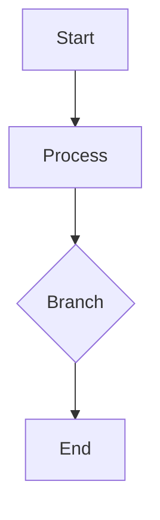

## Getting Started

- Download and install from the [Releases](https://github.com/flyhunterl/flymd/releases) page. Windows users can run `winget install flyhunterl.FlyMD`.
- Create/Open: `Ctrl+N` new, `Ctrl+O` open, `Ctrl+S` save, `Ctrl+Shift+S` save as.
- Library: manage files/folders in the sidebar with rename/move/delete.

## Modes

- Editor (source): write standard Markdown with smart pairing and great IME support.
- WYSIWYG: live rendering; double-click code blocks to edit.
- Switch: `Ctrl+E` edit/preview, `Ctrl+W` WYSIWYG toggle, `Ctrl+R` quick reading.
- Indentation: `Tab` to indent lists and selected lines.

## Focus Mode

- Press `Ctrl+Shift+F` to enter focus mode, hiding all UI elements.
- Pure space, pure creation—no title bar, no menus, no distractions.
- Ideal for long-form writing, creative bursts, or document presentations.
- Press `Ctrl+Shift+F` or `Esc` again to exit focus mode.

## Common Features

- Outline TOC: auto extract `H1–H6` with scroll sync.
- Safe preview: `markdown-it` + highlight + HTML sanitization.
- Extensions: WebDAV sync, AI assistant, publish to blogs.
- Customizable context menu: drag to reorder menu items, place frequent actions within reach.
- Find & Replace: `Ctrl+H` opens the find & replace panel.

## Multi-tab Workflow

- Press `Ctrl+T` anytime to open a blank tab so the active draft stays untouched.
- Use `Ctrl+Tab` / `Ctrl+Shift+Tab` to cycle across tabs and compare long documents without losing context.
- Hold `Ctrl` and left-click entries in the library to open them in background tabs.
- Tabs support right-click context menu for quick actions like close.

## Sticky Note Mode

- **One-click creation**: Right-click on a tab and select "Create Sticky Note" to open the document in a new window as a sticky note.
- **Auto-optimized**: Sticky note window automatically resizes to 400×300 pixels and moves to the top-right corner, enters focus mode + read mode, and closes the sidebar.
- **Always on top**: Control buttons appear at the top center of the window:
  - 📌 **Pin button**: Lock window position, disable dragging
  - ⬆️ **Top button**: Keep window always on top
- **Edit anytime**: Sticky note window can still switch to edit mode, retaining full editing capability.
- **Use cases**: Todo lists, meeting notes, code snippets, and other content you need to view at any time. Transform them into desktop sticky notes that won't be covered by other windows.

## Config & Portability

- Use the menu to one-click Export Config / Import Config and migrate your full environment (including extensions and settings) across machines.
- Enable Portable Mode so all config lives next to the app root, ideal for carrying FlyMD on a USB drive.

## Theme & Interface

- Automatically detects system dark mode preference and switches themes accordingly.
- Rich theme presets and background color choices.
- Multiple Markdown typography styles available, with easy theme settings panel.
- Tab bar styles optimized for dark mode for comfortable nighttime reading.

## Extensions & AI Assistant

### Built-in Free AI Service

Since v0.4.0, a free AI service is built-in, **ready out of the box** without API key configuration. Free service powered by SiliconFlow. The AI assistant extension installs silently on first launch.

### Install AI Writing Assistant

1. Open the **Extensions** panel → go to **Available**.
2. Find **AI Writing Assistant** → Install.
3. Complete initial setup (provider/model and API key). Most OpenAI-compatible services work.

### Capabilities

- **Polish**: improve wording while preserving meaning.
- **Correct**: grammar/spell correction with suggestions.
- **Continue**: continue writing from cursor with context.
- **Outline**: generate a structured outline from the current content.
- **Mermaid Charts**: generate Mermaid code from text (flowchart/sequence/gantt).
- **Selection-aware**: "Continue / Polish / Correct" in context menu can target selected text only.

### Interaction

1. Click the **AI** button on the toolbar to open the chat dialog.
2. Describe your intent, e.g. `Please generate a flowchart based on the article`.
3. The AI returns Mermaid code; click **Insert at cursor** or **Insert at end** to add the chart.

### Extension Development

- Extend functionality via plugins, installable from GitHub or HTTP URLs.
- Documentation: [Extension Docs (Chinese)](https://github.com/flyhunterl/flymd/blob/main/plugin.md) / [Extension Docs (English)](https://github.com/flyhunterl/flymd/blob/main/plugin.en.md)

## Images & Upload

- Paste/drag to insert. If S3/R2 is configured, upload and insert URL; otherwise fallback to local save.
- Local images render in-place; optional "Always save locally".

## Sync & Publish

- **WebDAV sync** (extension): visual progress, logs and conflict hints; optimized `MOVE` for rename/move.
- **Security**: end-to-end encryption and HTTP host whitelist supported; plaintext sync only to explicitly trusted hosts.
- **One-click publishing**: Typecho / WordPress / Halo extensions.

## Shortcuts

| Action | Shortcut |
| --- | --- |
| New file | `Ctrl+N` |
| New tab | `Ctrl+T` |
| Close current tab | `Alt+W` |
| Open file | `Ctrl+O` |
| Save file | `Ctrl+S` |
| Save as | `Ctrl+Shift+S` |
| Focus mode | `Ctrl+Shift+F` |
| Toggle edit/preview | `Ctrl+E` |
| Toggle WYSIWYG | `Ctrl+W` |
| Quick reading | `Ctrl+R` |
| Next tab | `Ctrl+Tab` |
| Previous tab | `Ctrl+Shift+Tab` |
| Bold | `Ctrl+B` |
| Italic | `Ctrl+I` |
| Insert link | `Ctrl+K` |
| Find & Replace | `Ctrl+H` |
| Indent list | `Tab` |
| Close dialog | `Esc` |

## Markdown Reference

### Headings

```
# H1
## H2
### H3
```

### Paragraphs & Line Breaks

```
Blank line between paragraphs.
Two spaces + Enter makes a line break.
```

### Emphasis & Inline Code

```
**bold**  *italic*  ~~strike~~  `inline code`
```

### Lists & Tasks

```
- Bullet 1
- Bullet 2
1. Numbered 1
2. Numbered 2
- [ ] Todo
- [x] Done
Tip: use Tab to indent lists.
```

### Links & Images

```
[OpenAI](https://openai.com)

```

### Code Blocks

````
```js
console.log('Hello FlyMD')
```
````

### Blockquote

```
> A quote here
```

### Table

```
| Col1 | Col2 |
| ---- | ---- |
| A    | B    |
```

### Math (KaTeX)

```
$c=\sqrt{a^2+b^2}$
```

### Mermaid

````

````

## Export

- Export to PDF / DOCX / WPS.
- Built-in PDF reader provides outline/bookmarks for easy navigation.

## Performance

| Metric | Value |
| --- | --- |
| Cold start | ≤300ms |
| Package size | ≤10MB |
| Memory usage | ≤50MB |
| Preview switch | ≤16ms |

## FAQ

**macOS says the app is "damaged" and won't open?**

Since the app isn't notarized by Apple, run in Terminal: `sudo xattr -r -d com.apple.quarantine /Applications/flymd.app`, or hold Control and click the app then select "Open". See [installation guide](https://github.com/flyhunterl/flymd#macOS-Installation-Notes) for details.

**Arch Linux blank screen?**

See [Solution for Arch Linux blank screen](https://github.com/flyhunterl/flymd/blob/main/arch.md).

**Right-click menu taken over by a plugin?**

Press `Shift + Right Click` to open the native context menu.

**Need larger content or different margins?**

Use `Shift + Mouse Wheel` to adjust the content width (margins), and `Ctrl + Mouse Wheel` to enlarge text and images.

**Does WYSIWYG mode support todo lists?**

Not yet—`- [ ]` / `- [x]` checkboxes only work in source/preview modes for now.
