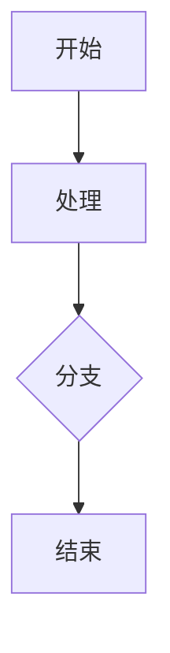

## 快速上手

- 下载并安装：前往 [发布页](https://github.com/flyhunterl/flymd/releases) 获取对应平台版本。Windows 用户可通过 `winget install flyhunterl.FlyMD` 一键安装。
- 创建/打开：`Ctrl+N` 新建、`Ctrl+O` 打开、`Ctrl+S` 保存、`Ctrl+Shift+S` 另存为。
- 文库：在侧边栏选择资料库，管理文件/文件夹，支持重命名/移动/删除。

## 编辑模式与所见模式

- 编辑模式（源码）：输入标准 Markdown 语法，中文输入法友好，智能补全括号/引号。
- 所见模式（WYSIWYG）：输入即渲染，所见即所得。双击代码块进入编辑。
- 切换：`Ctrl+E` 编辑/预览，`Ctrl+W` 所见模式开关，`Ctrl+R` 快速阅读。
- 缩进：支持 `Tab` 对列表与选中多行进行缩进。

## 专注模式

- 按下 `Ctrl+Shift+F` 进入专注模式，隐藏所有 UI 元素，只留纯净编辑区。
- 纯粹空间，纯粹创作，无标题栏、无菜单、无干扰，让思绪自由流淌。
- 适用场景：长文写作、创意迸发、文档展示等需要全屏专注的场合。
- 再次按下 `Ctrl+Shift+F` 或 `Esc` 退出专注模式。

## 常用功能

- 大纲目录：自动提取 `H1–H6`，点击跳转，滚动同步。
- 安全预览：内置 `markdown-it` + 代码高亮 + XSS 清洗。
- 扩展市场：安装 WebDAV 同步、AI 助手、发布到博客等扩展。
- 右键菜单自定义：支持拖拽排序右键菜单条目，高频操作放到顺手位置。
- 查找替换：`Ctrl+H` 打开查找替换面板。

## 多标签页

- `Ctrl+T` 随时开启空白标签页,当前文档保持原样不被覆盖。
- 使用 `Ctrl+Tab` / `Ctrl+Shift+Tab` 循环切换，长文稿与多篇文章来回对照不丢上下文。
- 在左侧文库中按住 `Ctrl` 再点击文档，可在新标签中打开并直接进入编辑模式。
- 标签页支持右键菜单，可直接在标签上进行关闭等操作。

## 便签模式

- **一键生成**：在标签页上右键选择"生成便签"，即可在新窗口以便签模式打开文档。
- **自动优化**：便签窗口自动缩小到 400×300 像素并移至右上角，进入专注模式+阅读模式，自动关闭侧栏。
- **置顶小窗**：窗口顶部中央显示控制按钮：
  - 📌 **图钉按钮**：锁定窗口位置，禁止拖动
  - ⬆️ **置顶按钮**：窗口始终在最上层
- **随时编辑**：便签窗口仍可切换到编辑模式，保留完整编辑能力。
- **使用场景**：待办事项、会议纪要、代码片段等需要随时查看的内容，一键变身桌面便签，不再被其他窗口遮挡。

## 配置与便携

- 在菜单中支持一键导出配置与导入配置，方便在多台设备间迁移完整环境（包含扩展与设置）。
- 支持开启便携模式，将所有配置写入应用根目录，适合放在 U 盘中随身携带。

## 主题与界面

- 自动读取系统深色模式偏好，必要时自动切换夜间主题。
- 提供丰富的主题预设与背景色选择。
- 多种 Markdown 排版风格可选，主题设置面板便于快速调节观感。
- 针对夜间模式单独优化标签栏样式，深色下阅读更舒适。

## 扩展与 AI 助手

### 内置免费 AI 服务

自 v0.4.0 版本起，内置免费 AI 服务，**开箱即用**，无需配置 API Key。免费服务由硅基流动提供支持。AI 助手扩展会在首次启动后静默安装。

### 安装 AI 写作助手

1. 打开应用的 **扩展** 面板 → 进入 **可安装的扩展**。
2. 搜索并选择 **AI 写作助手** → 点击安装。
3. 按提示进行首次配置（模型/服务商与密钥）。多数 OpenAI 兼容服务可直接使用。

### 常见能力

- **润色**：优化选中文本的用词与表达，保持语义不变。
- **纠错**：修正文法/错别字，必要时给出建议替换。
- **续写**：在光标处继续撰写段落，风格与上下文保持一致。
- **提纲**：基于全文或当前章节生成结构化大纲。
- **Mermaid 图表**：根据文本生成流程图/时序图/甘特图等 Mermaid 代码。
- **选区感知**：右键菜单中的"续写 / 润色 / 纠错"等操作可仅作用于选中文本，精准改写。

### 交互方式

1. 点击工具栏的 **AI** 按钮，弹出 AI 对话框。
2. 在对话框中直接描述你的需求，例如：`请根据文章内容生成流程图`。
3. AI 会生成 Mermaid 代码，点击 **插入光标处** 或 **插入文末** 将图表插入文档。

### 扩展开发

- 支持通过扩展插件增强功能，可从 GitHub 或 HTTP URL 安装。
- 开发文档：[扩展开发文档 (中文)](https://github.com/flyhunterl/flymd/blob/main/plugin.md) / [Extension Documentation (English)](https://github.com/flyhunterl/flymd/blob/main/plugin.en.md)

## 图片与图床

- 粘贴/拖拽图片自动处理：已配置 S3/R2 时优先上传并插入 URL；未配置或失败则回退本地保存。
- 本地图片即时可见；可在设置中选择"总是保存到本地"。

## 同步与发布

- **WebDAV 同步**（扩展）：可视化进度与日志，支持冲突提示与 `MOVE` 优化。
- **安全增强**：支持端到端加密与 HTTP 主机白名单，明文同步仅限显式信任的节点。
- **一键发布**：Typecho / WordPress / Halo 扩展，登录后选择文档发布。

## 常用快捷键

| 操作 | 快捷键 |
| --- | --- |
| 新建文件 | `Ctrl+N` |
| 新建标签页 | `Ctrl+T` |
| 关闭当前标签 | `Alt+W` |
| 打开文件 | `Ctrl+O` |
| 保存文件 | `Ctrl+S` |
| 另存为 | `Ctrl+Shift+S` |
| 专注模式 | `Ctrl+Shift+F` |
| 切换编辑/预览 | `Ctrl+E` |
| 切换所见模式 | `Ctrl+W` |
| 快速阅读 | `Ctrl+R` |
| 下一个标签页 | `Ctrl+Tab` |
| 上一个标签页 | `Ctrl+Shift+Tab` |
| 加粗 | `Ctrl+B` |
| 斜体 | `Ctrl+I` |
| 插入链接 | `Ctrl+K` |
| 查找替换 | `Ctrl+H` |
| 列表缩进 | `Tab` |
| 关闭弹窗 | `Esc` |

## Markdown 参考

以下为飞速MarkDown支持的常用语法速览。

### 标题

```
# 一级标题
## 二级标题
### 三级标题
```

### 段落与换行

```
段落之间留空行。
行尾加两个空格 + 回车可强制换行。
```

### 强调与行内代码

```
**加粗**  *斜体*  ~~删除线~~  `行内代码`
```

### 列表与任务列表

```
- 无序项 1
- 无序项 2
1. 有序项 1
2. 有序项 2
- [ ] 未完成
- [x] 已完成
提示：使用 Tab 进行缩进，可创建子列表。
```

### 链接与图片

```
[OpenAI](https://openai.com)

```

### 代码块

````
```js
console.log('Hello FlyMD')
```
````

### 引用

```
> 这是一段引用
```

### 表格

```
| 列1 | 列2 |
| --- | --- |
| A   | B   |
```

### 数学公式（KaTeX）

```
$c=\sqrt{a^2+b^2}$
```

### Mermaid 图表

````

````

## 导出

- 支持导出为 PDF / DOCX / WPS。
- PDF 阅读器内置大纲与书签，方便导航长文档。

## 性能指标

| 指标 | 数值 |
| --- | --- |
| 冷启动 | ≤300ms |
| 安装包体积 | ≤10MB |
| 常驻内存 | ≤50MB |
| 预览切换 | ≤16ms |

## 常见问题

**macOS 提示"已损坏，无法打开"怎么办？**

由于应用未经 Apple 公证，需要在终端执行：`sudo xattr -r -d com.apple.quarantine /Applications/flymd.app`，或按住 Control 键点击应用选择"打开"。详见 [安装指南](https://github.com/flyhunterl/flymd#macOS-安装注意事项)。

**Arch Linux 空白页面？**

请参阅 [Arch Linux 空白页面解决方法](https://github.com/flyhunterl/flymd/blob/main/arch.md)。

**右键菜单被插件占用了怎么办？**

使用 `Shift + 鼠标右键` 呼出原生菜单。

**如何放大文章或修改页边距？**

使用 `Shift + 滚轮` 调整内容区宽度（页边距），使用 `Ctrl + 滚轮` 放大文字和图片。

**所见模式支持 TODO 列表吗？**

目前不支持 `- [ ]`/`- [x]` 待办语法，请在源码/预览模式中编辑待办。
